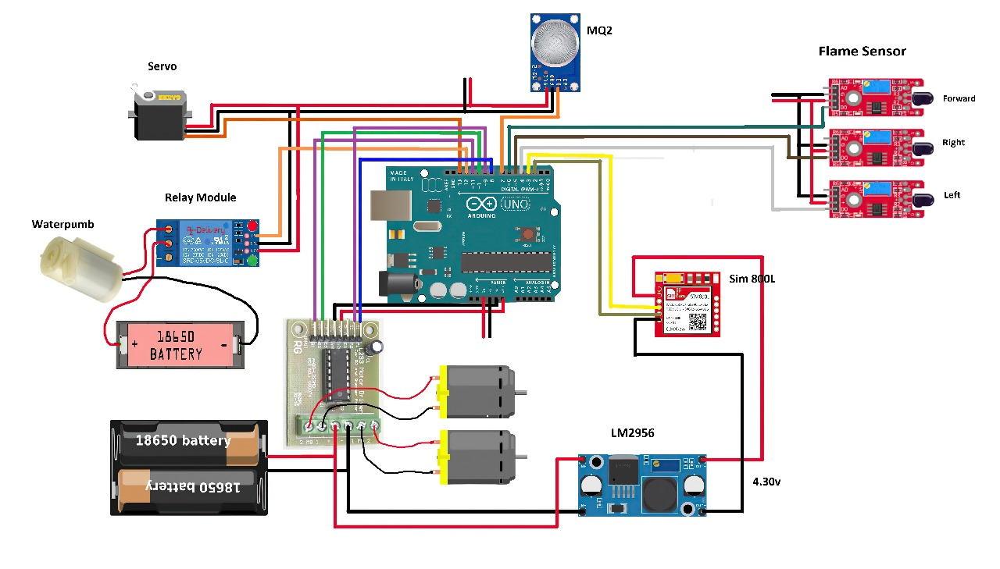

# Flame Fighting Robot

Welcome to the Flame Fighting Robot project repository! This project utilizes Arduino to create a robot capable of detecting flames using a flame sensor, moving with a motor driver, and deploying a fire-extinguishing mechanism using a pump controlled by a relay. Additionally, it features a GSM 800L module for call or SMS services.

## Project Overview

This project aims to build a firefighting robot that can autonomously detect and extinguish flames. The main components used in this project include:
- Flame sensor: For detecting the presence of flames.
- Motor driver: To control the movement of the robot.
- Smoke sensor: (Q2) for additional environmental sensing.
- Relay: To control the water pump for extinguishing flames.
- GSM 800L module: For communication via calls or SMS.

## Getting Started

### Prerequisites

Make sure you have the following components before starting:
- Arduino board
- Flame sensor
- Motor driver
- Smoke sensor (Q2)
- Relay
- GSM 800L module
- Water pump
- Power supply for the robot
  
### Installing Dependencies

Servo libraries are required for this project.

### Uploading the Code

Upload the provided Arduino code (`main.c`) to your Arduino board using the Arduino IDE.

## Usage

1. Power up the robot.
2. The flame sensor will continuously monitor for flames.
3. When flames are detected, the robot will move towards the source.
4. The smoke sensor provides additional environmental information.
5. Upon reaching the flames, the relay will activate the water pump to extinguish the fire.
6. The GSM module can be used for remote monitoring or receiving alerts via calls or SMS.
